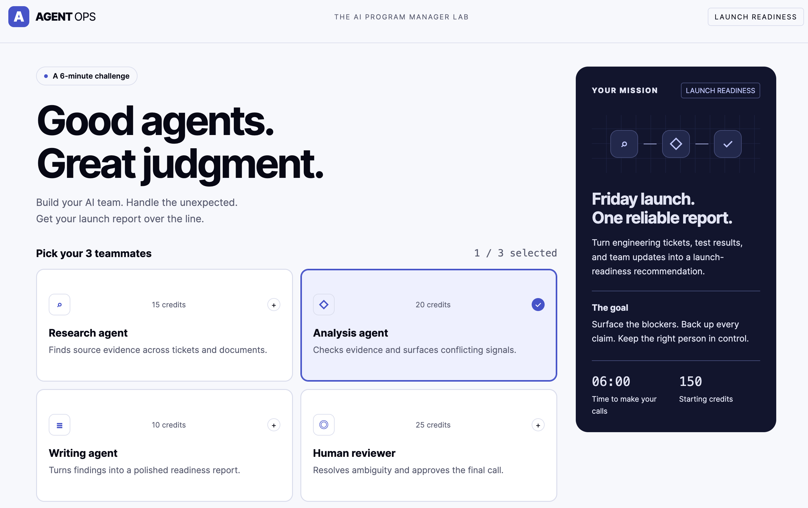

# Agent Ops

### AI Program Manager Lab — Simulated Agents. Real Tradeoffs.

A short browser-based simulation exploring how delivery and program leaders may work with AI agents while balancing speed, cost, evidence, quality, and human oversight.

🔗 **Live Demo:** https://taranjeet1017.github.io/agent-ops/

---

## Preview

---

## Executive Summary

Agent Ops is a hands-on experiment in AI-assisted software development and AI-enabled delivery thinking.

The game puts the player in the role of a Program Manager preparing for a product launch. The objective is to build an AI-assisted team, respond to changing delivery situations, surface blockers, and reach an evidence-backed launch-readiness recommendation.

The experience is deliberately designed around tradeoffs rather than simply maximizing automation.

**Simulated agents. Real delivery decisions.**

---

## What This Project Demonstrates

Agent Ops explores several ideas that are becoming increasingly relevant as AI becomes part of software delivery:

- Selecting the right AI capability for the task rather than using AI everywhere
- Balancing speed, cost, quality, and oversight
- Keeping humans involved in high-impact decisions
- Using evidence rather than relying only on generated recommendations
- Responding to changing delivery conditions and incomplete information
- Thinking about AI as part of the delivery operating model, not simply as a productivity tool

It also served as a practical experiment in using **Codex to move from an idea to a working browser-based product through iterative prompting, review, and refinement**.

---

## The Challenge

You have **6 minutes** to determine whether a product is ready to launch.

### Build your AI team

Choose **3 teammates** from capabilities such as:

- Research
- Analysis
- Writing
- Human Reviewer

You begin with **150 credits**, so every choice has a cost.

### Respond to delivery scenarios

Each session presents **10 randomly selected situations from a bank of 50 scenarios**.

The scenarios reflect the kinds of signals that influence launch decisions, including:

- Engineering tickets
- Test results
- Team updates
- Delivery blockers
- Conflicting or incomplete information

Your decisions affect how effectively the team reaches a launch-readiness recommendation.

---

## The Objective

Turn fragmented delivery information into a credible launch recommendation.

The challenge is not simply to move quickly.

It is to:

1. Identify the important signals
2. Surface blockers and risks
3. Use the right capability at the right time
4. Support conclusions with evidence
5. Keep appropriate human judgment in the loop

---

## Why I Built It

I wanted to better understand AI-assisted software development by actually building something with it.

Agent Ops was created as a small hands-on experiment using **Codex**, with the goal of exploring two things simultaneously:

1. How effectively an AI coding agent can translate intent into a working product and respond to iterative feedback
2. How AI may change the way delivery leaders think about teams, evidence, oversight, and decision-making

The project is intentionally small. The value for me was in experiencing the development workflow firsthand rather than building a large application.

---

## Human-in-the-Loop

One of the ideas behind Agent Ops is that adding AI does not remove the need for human judgment.

As AI takes on more research, analysis, generation, and execution, the question increasingly becomes:

> **Where should humans remain in the loop, and what decisions should remain theirs?**

The game therefore treats the Human Reviewer as part of the operating model rather than assuming that every task should be automated.

---

## Technology & Delivery

Agent Ops is a lightweight browser-based application deployed through **GitHub Pages**.

The project was developed iteratively with **Codex**, using a prompt → build → review → refine workflow.

🔗 **Live Application:** https://taranjeet1017.github.io/agent-ops/

---

## Project Scope

Agent Ops is a learning and experimentation project.

The agents in the game are **simulated**. It is not intended to represent a production autonomous-agent architecture or a real release-governance system.

The purpose is to explore the decisions and tradeoffs that emerge when AI capabilities become part of a delivery team.

---

## Related Project

### Delivery Knowledge Assistant

A separate AI project exploring grounded enterprise knowledge retrieval, chronology-aware RAG, source evidence, conversational follow-ups, and hallucination control.

https://github.com/taranjeet1017/delivery-knowledge-assistant

---

## About

I work across technology delivery, transformation, modernization, and AI-enabled engineering.

These projects are part of my hands-on exploration of how AI is changing software engineering, delivery models, and technology leadership.
